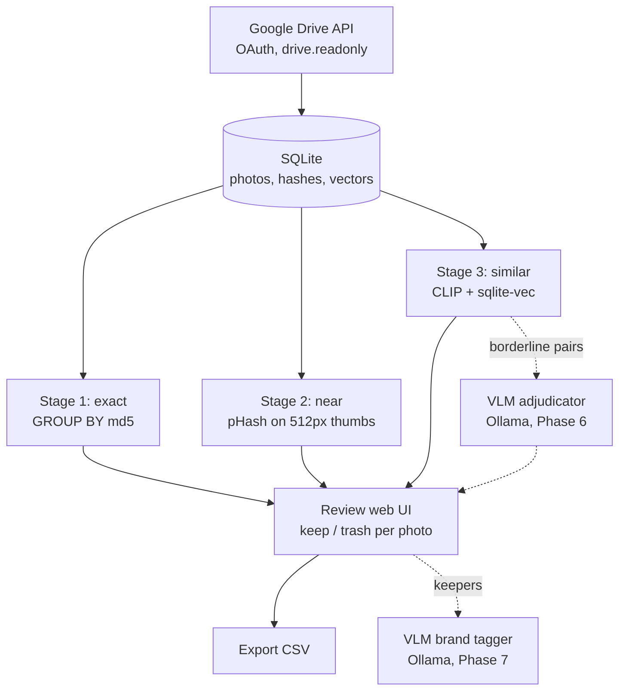

# doppel — v1 specification

A locally-served web app that inventories every image in a Google Drive
account and surfaces three tiers of redundancy for human review:

| Tier | Meaning | Detection |
|---|---|---|
| exact | byte-identical files | Drive `md5Checksum` metadata |
| near | same image re-encoded, resized, lightly edited | perceptual hash (pHash + dHash) |
| similar | same scene/subject, different shot | CLIP embeddings + vector search |

## Non-goals (v1)

- No writes to Drive. No trashing, moving, renaming. Output is a review UI
  and an exported CSV of files the user marked for deletion.
- No original-file downloads in Phases 0–5. Thumbnails only; Phase 7 is the
  sole exception, through `ImageFetcher`'s `orig` path.
- No categorization/tagging until Phase 7. Vision-LLM work is Phases 6–7
  and starts only after Phase 5 ships.
- No multi-user, no auth on the web UI, no deployment. Localhost only.

## Architecture



Single Python process: FastAPI serves the UI and API; one background worker
thread executes long-running stages and reports progress to the `scans`
table; the UI polls for progress.

## Repository layout

```
doppel/
├── Makefile
├── CLAUDE.md
├── SPEC.md
├── config.toml
├── pyproject.toml
├── src/doppel/
│   ├── app.py            # FastAPI app, routes, templates wiring
│   ├── drive.py          # OAuth flow, listing, ImageFetcher
│   ├── db.py             # schema creation, queries
│   ├── jobs.py           # worker thread, scan progress
│   ├── stages/
│   │   ├── exact.py
│   │   ├── near.py
│   │   └── similar.py
│   └── templates/        # Jinja2 + htmx
├── tests/
│   └── fakes.py          # fake Drive client for tests
└── cache/                # thumbnail cache (gitignored)
```

## Data model

```sql
CREATE TABLE photos (
  id            INTEGER PRIMARY KEY,
  drive_id      TEXT UNIQUE NOT NULL,
  name          TEXT NOT NULL,
  mime_type     TEXT NOT NULL,
  size          INTEGER,
  md5           TEXT,
  width         INTEGER,
  height        INTEGER,
  created_time  TEXT,
  modified_time TEXT,
  thumb_path    TEXT,     -- local cache path, NULL until fetched
  phash         TEXT,     -- 16-char hex, NULL until computed
  dhash         TEXT,
  status        TEXT NOT NULL DEFAULT 'active'  -- active | missing
);
CREATE INDEX idx_photos_md5 ON photos(md5);

-- sqlite-vec virtual table
CREATE VIRTUAL TABLE embeddings USING vec0(
  photo_id  INTEGER PRIMARY KEY,
  embedding FLOAT[512]
);

CREATE TABLE groups (
  id            INTEGER PRIMARY KEY,
  tier          TEXT NOT NULL,   -- exact | near | similar | vlm
  color_variant INTEGER NOT NULL DEFAULT 0,  -- structure matches, color differs
  created_at    TEXT NOT NULL
);
CREATE TABLE group_members (
  group_id INTEGER NOT NULL REFERENCES groups(id),
  photo_id INTEGER NOT NULL REFERENCES photos(id),
  score    REAL,                 -- hamming dist or cosine sim vs group anchor
  PRIMARY KEY (group_id, photo_id)
);

CREATE TABLE decisions (
  photo_id   INTEGER PRIMARY KEY REFERENCES photos(id),
  action     TEXT NOT NULL,      -- keep | trash
  decided_at TEXT NOT NULL
);

CREATE TABLE scans (
  id          INTEGER PRIMARY KEY,
  stage       TEXT NOT NULL,     -- sync | exact | near | similar
  status      TEXT NOT NULL,     -- running | done | failed
  processed   INTEGER DEFAULT 0,
  total       INTEGER,
  started_at  TEXT,
  finished_at TEXT,
  error       TEXT
);
```

Group rebuilds (re-running a stage) delete and recreate that tier's groups;
`decisions` are keyed by photo and survive rebuilds.

## Google Drive integration

**Auth.** OAuth installed-app flow. Scope: `https://www.googleapis.com/auth/drive.readonly`.
`credentials.json` supplied by the user at repo root; refresh token cached in
`token.json`. Both gitignored.

**Inventory sync.** `files.list` with:

- `q`: `mimeType contains 'image/' and trashed = false`
- `pageSize`: 1000, paginate via `nextPageToken` to completion
- `fields`: `nextPageToken, files(id, name, mimeType, size, md5Checksum,
  imageMediaMetadata(width, height), createdTime, modifiedTime, thumbnailLink)`

Upsert by `drive_id`. After a full listing, mark rows not seen as
`status = 'missing'`. Sync is a full re-list each run (simple, idempotent);
the Drive `changes` API is a possible later optimization, not v1.

**ImageFetcher.** The single choke point for image bytes:

```python
class ImageFetcher(Protocol):
    def get(self, drive_id: str, size: int | Literal["orig"] = 512) -> Path: ...
```

- Cache hit: return `cache/{drive_id}_{size}.jpg` if present.
- Miss: fetch `thumbnailLink` with the size suffix rewritten to `=s{size}`,
  sending the OAuth bearer token. Thumbnail links expire — on 403/404,
  refresh the link via `files.get` and retry once.
- No `thumbnailLink` (rare): fetch `files.get?alt=media` and downscale
  locally to `size` before caching. This is the only case where original
  bytes ever transit, and only as a fallback.
- `size="orig"` is implemented (fetch `alt=media`, cache as-is) but nothing
  in v1 calls it. It exists for v2.
- Exponential backoff on 429/403 rate-limit and 5xx responses.

Thumbnails are always JPEG regardless of source format, which conveniently
normalizes HEIC/RAW originals without local codec dependencies.

## Detection stages

**Stage 1 — exact.** Pure SQL: `GROUP BY md5 HAVING COUNT(*) > 1`, ignoring
NULL md5. No image bytes required. Note md5 identifies byte-identical files
only; the same photo re-exported lands in stage 2.

**Stage 2 — near.** For every active photo lacking a hash: fetch 512px
thumb, compute `imagehash.phash(img, hash_size=8)` and
`imagehash.dhash(img, hash_size=8)`, store as hex. Candidate pairs: BK-tree
(`pybktree`) over pHash with radius `near_hamming_max` (default 8). Confirm
each candidate pair with dHash Hamming distance ≤ `dhash_confirm_max`
(default 10) to suppress false positives. Merge confirmed pairs into groups
via union-find. Skip pairs already byte-identical (same md5).

Hashes are computed on grayscale, so desaturated or re-tinted copies of the
same shot land in this tier by design — and so do different colorways of
one base shot. After grouping, compute a normalized HSV hue/saturation
histogram distance between members (thumbnails are already cached); if any
pair exceeds `color_variant_min_delta`, set `groups.color_variant = 1`.
The UI badges these groups, and Phase 6 adjudicates them alongside the
cosine gray zone.

**Stage 3 — similar.** Model: `open_clip` `ViT-B-32` /
`laion2b_s34b_b79k`, device `mps` with CPU fallback, batch size 32.
L2-normalize; insert 512-d vectors into `embeddings`. For each photo, query
k=20 nearest neighbors; keep pairs with cosine ≥ `similar_cosine_min`
(default 0.92); union-find into clusters. Drop any cluster whose member set
is fully contained within an existing exact or near group — those add no
information. Threshold changes must not require re-embedding: grouping reads
stored vectors.

## Web UI

- `GET /` — dashboard: photo count, group counts per tier, last scan per
  stage, buttons to run each stage, progress bars polling `GET /scans/{id}`.
- `GET /groups?tier=exact|near|similar` — paginated group list, each group
  rendered as a thumbnail strip with member count.
- `GET /groups/{id}` — members side by side: thumbnail, name, dimensions,
  file size, dates, similarity score, and a color-variant badge when
  flagged. Keep/trash radio per member,
  `POST /groups/{id}/decisions` to save. Default preselect: keep the
  largest file, trash the rest (user can override).
- `GET /export` — all `action = 'trash'` decisions as CSV:
  `drive_id, name, size, md5, webViewLink-style URL`.
- `GET /thumb/{photo_id}` — serves the cached thumbnail (fetching on demand
  via ImageFetcher if absent).

## Configuration (`config.toml`)

```toml
thumb_size = 512
near_hamming_max = 8
dhash_confirm_max = 10
similar_cosine_min = 0.92
color_variant_min_delta = 0.25  # normalized HSV histogram distance; above = colorway
clip_model = "ViT-B-32/laion2b_s34b_b79k"
db_path = "doppel.db"
cache_dir = "cache"

[ollama]
host = "http://127.0.0.1:11434"
model = "qwen3-vl"           # any pulled multi-image vision model
adjudicate_band_min = 0.85   # pairs in [this, similar_cosine_min) go to the VLM
```

## Build phases

Each phase is independently shippable. Do not begin a phase until the
previous phase's acceptance criteria pass.

**Phase 0 — scaffold.** Repo layout above, `pyproject.toml` (uv), Makefile
with `help/setup/run/test/lint/scan`, ruff + pytest config, `.gitignore`
covering credentials/token/cache/db.
*Accept:* `make setup && make test && make lint` pass on a fresh clone.

**Phase 1 — Drive sync.** OAuth flow, full inventory sync runnable as
`make scan`, photos table populated, `scans` row with progress. Fake Drive
client + tests for pagination, upsert, and missing-file marking.
*Accept:* run against the real account; reported count matches Drive;
re-running changes nothing; interrupt + re-run recovers cleanly.

**Phase 2 — exact tier + minimal UI.** Stage 1 grouping, dashboard, group
list and detail pages with thumbnails (ImageFetcher lands here, on-demand).
*Accept:* exact-duplicate groups are browsable in the browser with visible
thumbnails.

**Phase 3 — near tier.** Batch hashing job with progress, BK-tree pairing,
dHash confirmation, near groups in the UI.
*Accept:* test fixtures (one image + resized copy + recompressed copy +
unrelated image) group correctly; job resumes after interruption without
re-hashing completed photos.

**Phase 4 — similar tier.** Embedding job, sqlite-vec storage, clustering,
similar groups in the UI with scores.
*Accept:* visually related fixtures cluster; changing
`similar_cosine_min` and re-running grouping does not re-embed.

**Phase 5 — review + export.** Decision persistence, largest-file
preselect, reviewed/unreviewed filtering, CSV export.
*Accept:* full flow works end to end: scan → review groups → export CSV.

**Phase 6 — VLM adjudication.** Ollama plumbing (`OllamaClient`), the
`vlm_results` table, the adjudication job over borderline similar pairs and
color-variant near groups, verdict groups (tier `vlm`) in the UI with the
model's one-line reason.
*Accept:* a fixture pair inside the band gets a stored verdict; the job
resumes after interruption; bumping the prompt version re-adjudicates
without clobbering prior results.

**Phase 7 — brand tagging.** Original-resolution fetch, the `tags` table,
the tagging job over non-trashed photos, brand filter and low-confidence
review queue in the UI.
*Accept:* a fixture with a visible logo from the candidate list tags
correctly; human corrections persist across re-runs.

## Vision LLM integration (Phases 6–7)

Ground rule: the VLM never scans the library. Stages 1–3 nominate a small
candidate set with cheap math; the VLM only rules on nominees (Phase 6) or
on deduped keepers (Phase 7).

**Shared plumbing.** Ollama serves on `127.0.0.1:11434`; the app calls it
through the `ollama` Python package via a single `OllamaClient`. Every
call: images attached as bytes, output forced to a JSON schema with the
`format` parameter, `model` + `prompt_version` recorded with the result.
Prompts are versioned files in `prompts/`, never inline strings. One
request in flight at a time; jobs resume by skipping rows already processed
for the current model + prompt version. Model requirement: vision-capable,
and for Phase 6 specifically multi-image per prompt (qwen3-vl, gemma3).
llama3.2-vision accepts one image per request and cannot compare a pair.

```sql
CREATE TABLE vlm_results (
  id             INTEGER PRIMARY KEY,
  task           TEXT NOT NULL,        -- adjudicate | brand
  photo_id       INTEGER NOT NULL REFERENCES photos(id),
  photo_id_b     INTEGER REFERENCES photos(id),  -- adjudicate only
  model          TEXT NOT NULL,
  prompt_version TEXT NOT NULL,
  response       TEXT NOT NULL,        -- raw JSON from the model
  verdict        TEXT,
  confidence     REAL,
  created_at     TEXT NOT NULL
);

CREATE TABLE tags (
  photo_id   INTEGER NOT NULL REFERENCES photos(id),
  kind       TEXT NOT NULL,            -- 'brand'
  value      TEXT NOT NULL,
  confidence REAL,
  source     TEXT NOT NULL,            -- vlm | human
  created_at TEXT NOT NULL,
  PRIMARY KEY (photo_id, kind)
);
```

**Phase 6 workflow — adjudicating borderline duplicates.**

1. Stages 1–3 run unchanged and score all candidate pairs.
2. Select pairs with cosine in `[adjudicate_band_min, similar_cosine_min)`
   — too weak to auto-group, too strong to ignore — plus pairs inside
   near-tier groups flagged `color_variant`.
3. Load both cached 512px thumbnails for the pair.
4. One chat call: both images + `prompts/adjudicate_v1.txt` ("same shot,
   near-duplicate, colorway variant, or different photo?"), schema
   `{verdict: same|near|variant|different, reason}`.
5. Store in `vlm_results`; `same`/`near` verdicts become tier-`vlm` groups;
   `variant` verdicts become tier-`vlm` groups with `color_variant = 1`.
6. The UI shows the verdict and reason beside the group; the human decides.

**Phase 7 workflow — brand tagging.**

1. Runs after review, over photos without a `trash` decision.
2. Fetch original resolution via `ImageFetcher.get(id, "orig")` — logos
   need pixels; thumbnails are insufficient here.
3. One chat call per photo: image + `prompts/brand_v1.txt` containing the
   user-supplied closed candidate list ("choose one of [...] or `unknown`;
   name the evidence: logo, label, or pattern"), schema
   `{brand, evidence, confidence}`.
4. Write to `tags` with `source = 'vlm'`.
5. UI: brand filter plus a low-confidence queue for manual confirmation.
   Corrections write `source = 'human'` and are never overwritten by
   re-runs.
6. Start with full images. Add a garment-crop pre-pass only if illegible
   logos prove to be the measured failure mode.

Known constraints: a local VLM costs seconds per image — fine for hundreds
of adjudications or thousands of keepers, hopeless as a primary detector,
which is why it sits last in the pipeline. Brand ID without a visible logo
is unreliable at any resolution; the closed candidate list is the main
accuracy lever, since open-ended prompting hallucinates brands.
